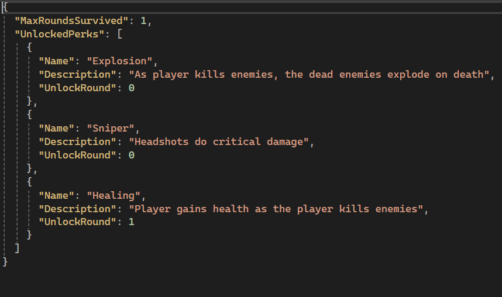
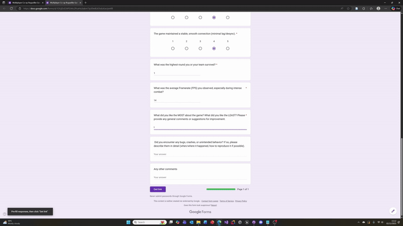

This technical commentary details the methods for collecting player feedback, consent, and extensive game data within an Unreal Engine 5.6 C++ multiplayer roguelike project. It outlines the specific native C++ functions utilized for logging and explains how this information is used to drive Quality Assurance (QA) and development improvements.

## Player Feedback and Consent Collection

To ensure an ethical and streamlined process for gathering both qualitative player feedback and required consent, a system leveraging external tools was integrated:

- Google Forms Integration: A structured questionnaire was created using Google Forms. This form served a dual purpose:

    - Consent Capture: It included a mandatory field requiring players to provide explicit consent for their technical data and non technical data to be logged. The clause clearly outlined the data types (telemetry, performance and player feedback) and their sole use (development and QA).

    - Qualitative Feedback: It provided open and structured fields for players to submit detailed commentary on game balance, feature enjoyment, perceived bugs, and general play experience.

- QR Code Implementation: To maximize participation and minimise disruption to the game flow, a QR code linking directly to the Google Form was generated. This QR code was prominently displayed in the game's main menu, providing a clear opportunity for players to consent and submit feedback at their convenience.

## Telemetry and Performance Data Logging

All game data is logged into two separate JSON files on the player’s machine, utilising native Unreal Engine C++ for handling, serialization, and file I/O.

- Telemetry Data (Telemetry.json): This file records player behavior and progression, including the player's MaxRoundsSurvived and an UnlockedPerks array, which details the name and description of every perk acquired during the run.

- Performance Data (Performance.json): This file captures technical metrics sampled frequently, logging the Timestamp, CPU Cycles, FPS, Frame Time, and Memory Used (MB).

## Tools, Frameworks, and Services Used

The data collection pipeline is built on the following technologies:

- Game Engine: Unreal Engine 5.6 (C++) is the core development and logging framework.

- Feedback/Consent: Google Forms and an external QR Code Generator.

- Data Handling: The Unreal Engine's native Core and Json modules are used for all data structure, serialization, and file operations, ensuring multi-platform compatibility.
- Data Capture: I used functions like `FPlatformTime::Cycles()` to capture CPU Cycles, `FPlatformMemory::GetStats()` to capture Memory Used(MB) and `GetWorld()->GetDeltaSeconds()` for both Frame Time and FPS

## Informing QA and Game Improvements

The comprehensive data provides dual benefits for development:

- Informing QA: The high-frequency Performance.json allows me to correlate spikes in Frame Time and CPU Cycles with specific points in the game session (Timestamp). This directs effort to debug and optimize bottleneck-causing events within the complex multiplayer code, ensuring a smooth framerate.

- Game Improvements: Analyzing the MaxRoundsSurvived provides quantitative feedback on the roguelike difficulty curve. By correlating this metric with the UnlockedPerks array, I can identify which perks are being unlocked.

## Photos and etc

[Source Code Link](https://github.com/SiddPlus/FMPGame)

